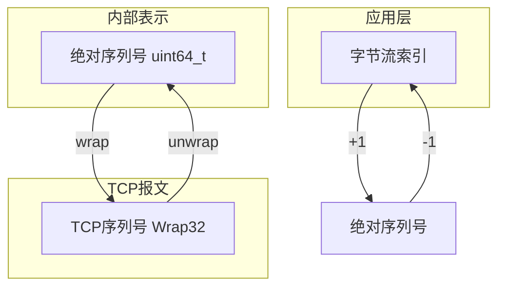
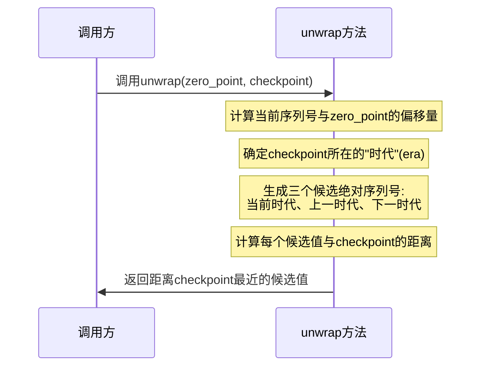

# CS144 Lab2实战记录：TCP接收器的实现

## 1 实验背景与要求

在TCP协议中，接收器(TCP Receiver)扮演着至关重要的角色：它负责接收来自网络的数据包，正确解析序列号，重组数据，并向发送方提供必要的反馈信息（确认号和窗口大小）。在Stanford CS144 Lab2中，我们将基于Lab1实现的重组器（Reassembler），完成TCP接收器的实现。

TCP接收器的主要职责是接收来自发送方的TCP报文段，处理其中的序列号，并将数据重组为连续的字节流。同时，它还需要向发送方提供确认号(ACK)和窗口大小(Window Size)，以实现流量控制。其架构如下图所示：


实现TCP接收器需要特别理解TCP序列号的以下特性：

1. **有限位宽**：在TCP头部中，序列号只有32位，在传输大量数据时会循环使用
2. **随机初始值**：连接建立时使用随机的初始序列号(ISN)，防止与之前连接的序列号混淆
3. **特殊控制标志占用序列号**：SYN和FIN标志各占一个序列号位置

Lab2的任务可以分为两个主要部分：

1. **实现Wrap32类**：处理32位序列号到64位绝对序列号的相互转换
2. **实现TCPReceiver类**：接收TCP报文，管理序列号，与重组器配合

## 2 序列号转换设计

在TCP中，每个字节都有一个唯一的序列号。但TCP报文头部中只使用32位来表示序列号，这意味着在传输大量数据时，序列号会循环使用。此外，TCP连接建立时会选择一个随机的初始序列号ISN作为起点。因此，我们需要在32位的"包装"序列号和64位的"绝对"序列号之间进行转换，序列号的三种表示方法如下和转换逻辑如下：

1. **TCP序列号（seqno）**：32位整数，在TCP报文头部中使用，会循环使用
2. **绝对序列号（absolute seqno）**：64位整数，从0开始，不会溢出，包含SYN和FIN标志
3. **字节流索引（stream index）**：64位整数，从0开始，不包含SYN和FIN标志



以下是一个具体的例子，假设一个字节流包含"cat"三个字符，ISN为$2^{32} - 2$：


### 2.2 Wrap32类设计

Wrap32类封装了32位序列号，并提供了两个关键方法：

```cpp
class Wrap32 {
public:
  explicit Wrap32(uint32_t raw_value) : raw_value_(raw_value) {}

  // 将绝对序列号转换为相对序列号
  static Wrap32 wrap(uint64_t n, Wrap32 zero_point);

  // 将相对序列号转换为绝对序列号
  uint64_t unwrap(Wrap32 zero_point, uint64_t checkpoint) const;

  // 操作符重载
  Wrap32 operator+(uint32_t n) const { return Wrap32{raw_value_ + n}; }
  bool operator==(const Wrap32& other) const { return raw_value_ == other.raw_value_; }

protected:
  uint32_t raw_value_{};
};
```

#### 2.2.1 wrap方法实现

`wrap`方法非常简单，只需将绝对序列号加上初始序列号，然后通过类型转换自动取低32位。

```cpp
Wrap32 Wrap32::wrap(uint64_t n, Wrap32 zero_point) {
  // 将绝对序列号加上初始序列号，然后取低32位
  return Wrap32{static_cast<uint32_t>(n + zero_point.raw_value_)};
}
```

#### 2.2.2 unwrap方法实现

`unwrap`方法需要解决一个问题：同一个32位序列号可能对应多个64位绝对序列号（每隔$2^{32}$就会重复一次）。因此，我们需要一个"checkpoint"来确定返回哪个绝对序列号—通常是最接近检查点的那个（因为除了最近的那个其他的值都离得很远，不可能在网络中停留那么久）。




```cpp
uint64_t Wrap32::unwrap(Wrap32 zero_point, uint64_t checkpoint) const {
  // 计算相对偏移
  uint32_t offset = raw_value_ - zero_point.raw_value_;
  
  // 计算checkpoint所在的"时代"(era)
  uint64_t checkpoint_era = checkpoint >> 32;
  
  // 生成三个候选值：当前时代、下一时代、上一时代
  uint64_t candidate1 = (checkpoint_era << 32) + offset;  // 当前时代
  uint64_t candidate2 = candidate1 + (1ULL << 32);        // 下一时代
  uint64_t candidate3 = checkpoint_era > 0 ? candidate1 - (1ULL << 32) : 0;  // 上一时代
  
  // 计算各候选值与checkpoint的距离
  uint64_t distance1 = (candidate1 > checkpoint) ? 
                       (candidate1 - checkpoint) : (checkpoint - candidate1);
  uint64_t distance2 = (candidate2 > checkpoint) ? 
                       (candidate2 - checkpoint) : (checkpoint - candidate2);
  uint64_t distance3 = checkpoint_era > 0 ? 
                       ((candidate3 > checkpoint) ? 
                        (candidate3 - checkpoint) : (checkpoint - candidate3)) 
                       : UINT64_MAX;
  
  // 返回距离checkpoint最近的候选值
  if (distance1 <= distance2 && distance1 <= distance3) {
    return candidate1;
  } else if (distance2 <= distance1 && distance2 <= distance3) {
    return candidate2;
  } else {
    return candidate3;
  }
}
```

## 3 TCP接收器的实现

有了序列号转换工具，我们可以开始实现TCP接收器。首先，让我们了解TCP接收器需要处理的消息格式。

### 3.1 TCP发送方消息 (TCPSenderMessage)

```cpp
struct TCPSenderMessage {
  Wrap32 seqno{0};      // 序列号
  bool SYN{};           // SYN标志
  std::string payload{};// 数据
  bool FIN{};           // FIN标志
  bool RST{};           // RST标志
  
  // 计算此消息占用多少序列号
  size_t sequence_length() const { return SYN + payload.size() + FIN; }
};
```

### 3.2 TCP接收方消息 (TCPReceiverMessage)

```cpp
struct TCPReceiverMessage {
  std::optional<Wrap32> ackno{}; // 确认号
  uint16_t window_size{};        // 窗口大小
  bool RST{};                    // RST标志
};
```

### 3.3 TCP接收器的定义

TCP接收器包含两个核心方法：

- `receive`：处理接收到的TCP报文
- `send`：生成反馈信息

其中成员变量`std::optional<Wrap32> isn_`存储初始序列号，使用optional表示可能尚未设置（也可以通过标记来判断）。

```cpp
class TCPReceiver {
public:
  // 使用给定的Reassembler构造
  explicit TCPReceiver(Reassembler&& reassembler) 
    : reassembler_(std::move(reassembler)) {}

  // 接收TCP发送方消息
  void receive(TCPSenderMessage message);

  // 发送TCP接收方消息
  TCPReceiverMessage send() const;

  // 访问输出
  const Reassembler& reassembler() const { return reassembler_; }
  Reader& reader() { return reassembler_.reader(); }
  const Reader& reader() const { return reassembler_.reader(); }
  const Writer& writer() const { return reassembler_.writer(); }

private:
  Reassembler reassembler_;
  std::optional<Wrap32> isn_{}; // 初始序列号
};
```

### 3.3 receive方法实现

`receive`方法负责处理接收到的TCP报文，将数据交给重组器，完成从32位序列号到字节流索引的转换。处理逻辑如下：

1. 检查RST标志，如果设置了则标记流错误并返回
2. 检查SYN标志，如果是第一次收到SYN则记录初始序列号
3. 如果尚未收到SYN，不处理任何数据
4. 使用`unwrap`方法将TCP序列号转换为绝对序列号
5. 将绝对序列号转换为字节流索引（减1，因为SYN占一个序列号）
6. 调用重组器的`insert`方法处理数据

```cpp
void TCPReceiver::receive(TCPSenderMessage message) {
  // 处理RST标志
  if (message.RST) {
    reassembler_.reader().set_error();
    return;
  }

  // 处理SYN标志（建立连接）
  if (message.SYN && !isn_.has_value()) {
    isn_ = message.seqno;
  }
  
  // 在接收到SYN之前不处理数据
  if (!isn_.has_value()) {
    return;
  }
  
  // 计算绝对序列号和流索引
  const uint64_t checkpoint = reassembler_.writer().bytes_pushed();
  const uint64_t abs_seqno = message.seqno.unwrap(isn_.value(), checkpoint);
  
  // 确定流索引（字节流中的位置）
  const uint64_t stream_index = message.SYN ? 0 : abs_seqno - 1;
  
  // 插入数据到重组器
  reassembler_.insert(stream_index, message.payload, message.FIN);
}
```

### 3.4 send方法实现

`send`方法负责生成反馈信息，包括确认号和窗口大小。`send`方法的处理逻辑：

1. 检查是否已接收到SYN，如果是则计算确认号
2. 计算绝对确认号：1(SYN) + 已写入字节数 + 1(如果FIN已处理)
3. 使用`wrap`方法将绝对确认号转换为TCP序列号
4. 计算窗口大小，受限于uint16_t最大值(65535)
5. 设置RST标志，如果流发生错误


```cpp
TCPReceiverMessage TCPReceiver::send() const {
  TCPReceiverMessage msg;
  
  // 只有在建立连接(接收SYN)后才设置ackno
  if (isn_.has_value()) {
    // 计算绝对ackno: SYN(1) + bytes_pushed + FIN(如果适用)
    const uint64_t abs_ackno = 1 + reassembler_.writer().bytes_pushed() 
                             + (reassembler_.writer().is_closed() ? 1 : 0);
    
    // 转换为32位包装序列号
    msg.ackno = Wrap32::wrap(abs_ackno, isn_.value());
  }
  
  // 设置窗口大小（上限为uint16_t最大值）
  const uint64_t window_size = reassembler_.reader().writer().available_capacity();
  msg.window_size = static_cast<uint16_t>(
      std::min(window_size, static_cast<uint64_t>(UINT16_MAX)));
  
  // 设置RST标志（如果流有错误）
  msg.RST = reassembler_.reader().has_error();
  
  return msg;
}
```

## 4 关键场景分析

TCP接收器需要处理多种情况，下面我们分析几个关键场景：

1. 当接收到带有SYN标志的报文时，TCP接收器需要记录初始序列号(ISN)，并开始接受数据。
2. 当接收到带有FIN标志的报文时，TCP接收器需要关闭字节流，并更新确认号。
3. TCP接收器通过"窗口大小"参数实现流量控制，告诉发送方它准备好接收多少字节的数据。窗口大小取决于字节流的可用容量，最大值为65535（16位无符号整数的最大值）。
4. TCP使用RST（重置）标志表示连接发生错误。TCP接收器在两种情况下处理RST标志：
	* 收到带有RST标志的报文时，设置字节流的错误状态
	* 当字节流处于错误状态时，在发送的消息中设置RST标志

## 5 调试经验

1. 序列号转换是整个实现中最容易出错的部分，特别是`unwrap`方法。建议使用纸笔手工跟踪几个测试用例，包括序列号环绕的情况。

2. 计算确认号时，需要考虑SYN和FIN标志。一个常见的错误是忘记这些标志也占用序列号空间。确认号应该是期望接收的下一个字节的序列号，而不仅仅是已接收字节数。

3. 将序列号转换为流索引是另一个容易混淆的地方。SYN占用一个序列号位置，但它不是数据流的一部分，所以需要特别处理：

	- 如果是SYN报文，流索引为0

	- 其他情况下，流索引 = 绝对序列号 - 1

4. 虽然现实场景中不太可能出现SYN+FIN或者SYN+Data的报文，但我们依然要做这种处理，如果初始化好ISN直接返回的话会通过不了case，所以还是需要将SYN的报文插入重组器。