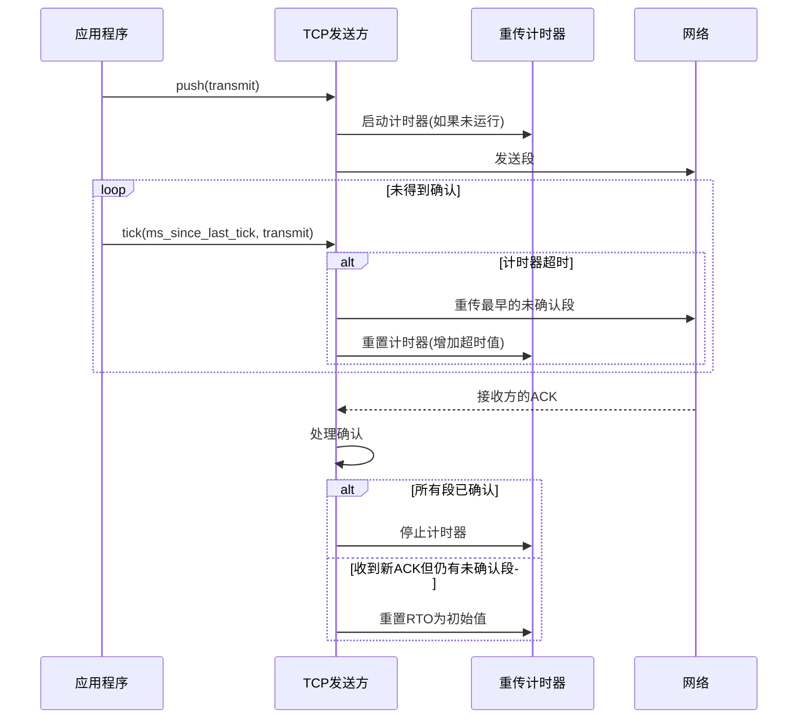
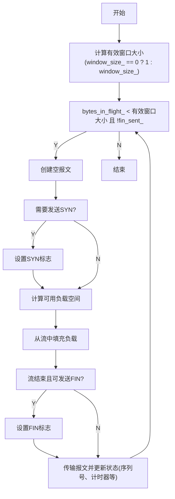
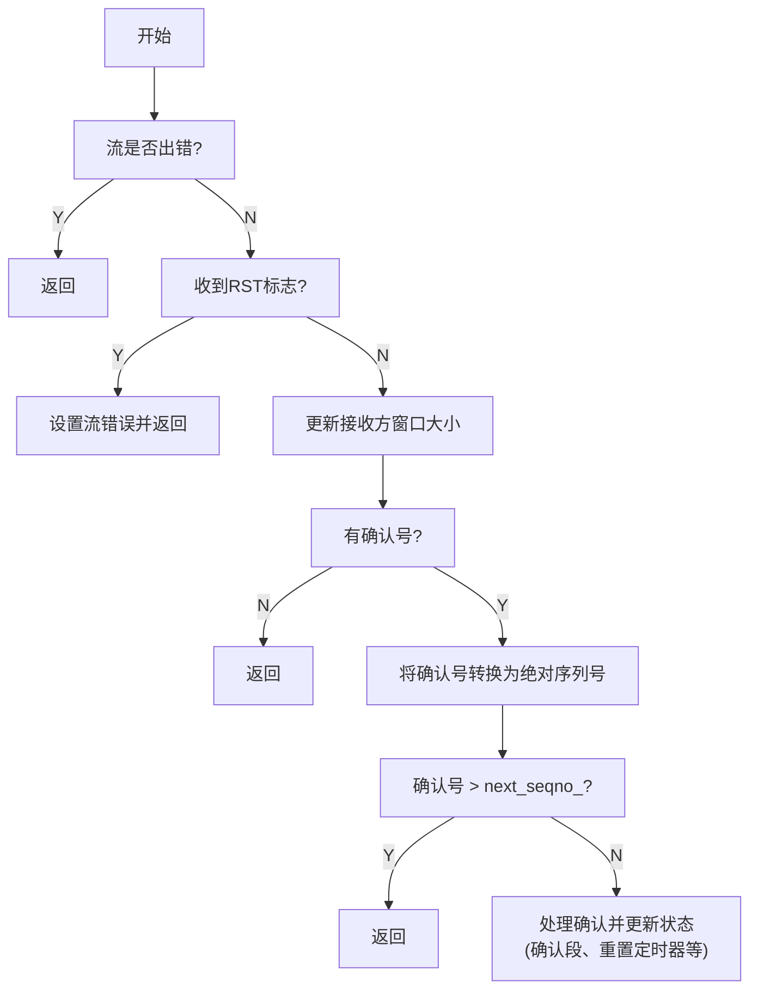
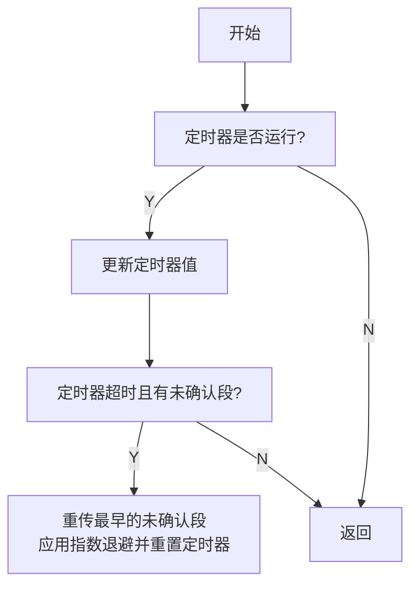

# CS144 Lab3 实战记录：TCP 发送器实现

## 1 实验背景与目标

在 TCP 协议中，发送器（TCP Sender）是实现可靠传输的核心组件。它的主要职责是将应用层的字节流分割为 TCP 段，通过不可靠的网络传输，并确保数据被可靠接收。在 Stanford CS144 Lab3 中，我们需要基于 Lab0 实现的字节流（ByteStream）、Lab1 的字节流重组（）、 Lab2 实现的接收器（TCPReceiver），完成 TCP 发送器的实现。TCP发送端的主要职责包括：

- 维护发送窗口和序列号
- 实现数据分段和传输
- 处理重传定时器
- 响应接收方的确认和流量控制

## 2 TCP发送器的实现

### 2.1 整体流程

其工作流程可以概括为：应用层数据通过`push`接口进入发送器，发送器根据当前窗口状态封装 TCP 段并发送，同时启动重传定时器；接收到 ACK 时更新确认状态和窗口信息，定时器超时则触发重传。这一过程通过`push`、`receive`、`tick`三个核心函数的协同，实现了数据发送、确认处理和超时重传的闭环控制。



### 2.2 核心组件

1. 连接状态标志

	- `syn_sent_`：表示 SYN 握手包是否已发送。作为三次握手的起点，SYN 段占用 1 字节序列号，必须在数据传输前发送

	- `fin_sent_`：标记 FIN 结束包的发送状态。当字节流读取完毕时，发送 FIN 段表示数据传输完毕，同样占用 1 字节序列号

2. 序列号管理

	- `isn_`（初始序列号）：每个连接随机生成的初始序列号，用于防止历史连接的重复数据干扰

	- `next_seqno_`：下一个待发送的字节序列号，初始为 0，每次发送段后递增段的总长度（包括 SYN/FIN 标志占用）

	- `ackno_`：接收端已确认的最高字节序列号，通过 ACK 解析得到，用于标记已可靠传输的边界

	- `bytes_in_flight_`：当前已发送但未确认的字节总数，实时反映窗口的占用情况

3. 窗口与定时器状态

	- `window_size_`：接收端通告的可用窗口大小，初始化为 1（允许窗口探测），0 表示接收缓冲区已满

	- `initial_RTO_ms_`：初始重传超时时间，实验中通常设为 100ms，作为定时器的基准参数

	- `current_RTO_ms_`：动态调整的当前超时时间，每次重传后按指数退避算法加倍（如 200ms、400ms...）

	- `timer_`：记录自上次定时器重置后的 elapsed 时间，用于判断是否超时

	- `timer_running_`：标记定时器是否处于运行状态，避免重复启动

	- `consecutive_retransmissions_`：连续重传次数，用于拥塞控制中的阈值调整（实验中暂未实现完整拥塞控制）

```cpp
#pragma once

#include "byte_stream.hh"
#include "tcp_receiver_message.hh"
#include "tcp_sender_message.hh"

#include <functional>
#include <queue>

class TCPSender
{
public:
  /* Construct TCP sender with given default Retransmission Timeout and possible ISN */
  TCPSender( ByteStream&& input, Wrap32 isn, uint64_t initial_RTO_ms ) 
    : input_( std::move( input ) ), isn_( isn ), initial_RTO_ms_( initial_RTO_ms ), current_RTO_ms_( initial_RTO_ms )
  {}

  /* Generate an empty TCPSenderMessage */
  TCPSenderMessage make_empty_message() const;

  /* Receive and process a TCPReceiverMessage from the peer's receiver */
  void receive( const TCPReceiverMessage& msg );

  /* Type of the `transmit` function that the push and tick methods can use to send messages */
  using TransmitFunction = std::function<void( const TCPSenderMessage& )>;

  /* Push bytes from the outbound stream */
  void push( const TransmitFunction& transmit );

  /* Time has passed by the given # of milliseconds since the last time the tick() method was called */
  void tick( uint64_t ms_since_last_tick, const TransmitFunction& transmit );

  // Accessors
  uint64_t sequence_numbers_in_flight() const;  // For testing: how many sequence numbers are outstanding?
  uint64_t consecutive_retransmissions() const; // For testing: how many consecutive retransmissions have happened?
  const Writer& writer() const { return input_.writer(); }
  const Reader& reader() const { return input_.reader(); }
  Writer& writer() { return input_.writer(); }

private:
  Reader& reader() { return input_.reader(); }

  ByteStream input_;                     // the outbound stream used to read data to send
  Wrap32 isn_;                           // initial Sequence Number

  /* State flag */
  bool syn_sent_{};                        // has the SYN flag been sent?
  bool fin_sent_{};                        // has the FIN flag been sent?
  
  /* Window management */
  uint16_t window_size_{ 1 };                 // size of the receiver's window
  uint64_t next_seqno_{};                  // next sequence number to be sent
  uint64_t ackno_{};                       // acknowledgment number of the receiver
  uint64_t bytes_in_flight_{};             // number of bytes sent but not acknowledged

  /* Retransmission timer management */
  uint64_t initial_RTO_ms_;                 // initial RTO in milliseconds
  uint64_t current_RTO_ms_{};                // current RTO in milliseconds             
  uint64_t timer_{};                        // timer for retransmission
  bool timer_running_{};                   // is the timer running?
  uint64_t consecutive_retransmissions_{}; // number of consecutive retransmissions

  // outstanding segments waiting for acknowledgment
  std::queue<TCPSenderMessage> outstanding_messages_{};
};
```


### 2.3 窗口管理

接收端通过 ACK 中的窗口字段告知发送端可用接收缓冲区大小，发送器必须严格遵循这一限制。这里需要处理两种特殊情况：

1. **零窗口处理**：当`window_size_`为 0 时，视为接收缓冲区已满，发送器应停止发送数据（除了窗口探测段）。实验中采用 "窗口探测" 机制，将零窗口视为有效窗口为 1，允许发送 1 字节的段来探测窗口是否更新
2. **有效窗口计算**：实际可用窗口需考虑已发送未确认的字节（`bytes_in_flight_`），公式为：
	`有效窗口 = max(1, window_size_) - bytes_in_flight_`
	这里的`max(1, window_size_)`确保零窗口时仍允许探测，而减去已发送字节则保证不超过接收端的处理能力


### 2.4 关键函数实现

#### 2.4.1 push函数

`push`函数是TCP发送端的核心功能，负责将输入流中的数据封装成TCP报文并发送。其核心逻辑如下图所示：



```cpp
void TCPSender::push(const TransmitFunction& transmit)
{
  // 计算有效窗口大小(将0窗口视为1进行窗口探测)
  const uint16_t effective_window = window_size_ ? window_size_ : 1;

  // 持续发送直到窗口用尽或FIN已发送
  while (bytes_in_flight_ < effective_window && !fin_sent_) {
    TCPSenderMessage msg = make_empty_message();

    // 如果连接未初始化，设置SYN标志
    if (!syn_sent_) {
      msg.SYN = true;
      syn_sent_ = true;
    }

    // 计算考虑窗口和已发送数据后的可用负载空间
    const uint64_t remaining_capacity = effective_window - bytes_in_flight_;
    const size_t max_payload = min(remaining_capacity - msg.sequence_length(), // 考虑SYN/FIN占用
                                  TCPConfig::MAX_PAYLOAD_SIZE);

    // 从输入流填充负载，不超过计算出的最大容量
    while (reader().bytes_buffered() && msg.payload.size() < max_payload) {
      const string_view data = reader().peek().substr(0, max_payload - msg.payload.size());
      msg.payload += data;
      reader().pop(data.size());
    }

    // 如果流已结束且窗口允许，设置FIN标志
    if (!fin_sent_ && reader().is_finished() && (remaining_capacity > msg.sequence_length())) {
      msg.FIN = true;
      fin_sent_ = true;
    }

    // 跳过空段(除了SYN/FIN外)
    if (msg.sequence_length() == 0)
      break;

    // 传输段并更新跟踪状态
    transmit(msg);
    next_seqno_ += msg.sequence_length();
    bytes_in_flight_ += msg.sequence_length();
    outstanding_messages_.push(move(msg));

    // 如果定时器未运行，启动重传定时器
    if (!timer_running_) {
      timer_running_ = true;
      timer_ = 0;
    }
  }
}
```

#### 2.4.2 receive函数

`receive`函数处理从TCP接收方返回的确认信息，更新窗口大小和确认序列号：




```cpp
void TCPSender::receive(const TCPReceiverMessage& msg)
{
  // 处理错误状态
  if (input_.has_error())
    return;
  if (msg.RST) {
    input_.set_error();
    return;
  }

  // 更新接收方窗口大小
  window_size_ = msg.window_size;

  // 如果没有确认号，直接返回
  if (!msg.ackno)
    return;

  // 将相对确认号转换为绝对序列空间
  const uint64_t ack_abs = msg.ackno->unwrap(isn_, next_seqno_);

  // 验证确认号
  if (ack_abs > next_seqno_)
    return; // 确认了未发送的数据

  bool acked = false;
  // 处理所有完全确认的段
  while (!outstanding_messages_.empty()) {
    const auto& front_msg = outstanding_messages_.front();
    const uint64_t segment_end = ackno_ + front_msg.sequence_length();

    if (segment_end > ack_abs)
      break; // 部分确认

    // 更新跟踪信息
    acked = true;
    ackno_ = segment_end;
    bytes_in_flight_ -= front_msg.sequence_length();
    outstanding_messages_.pop();
  }

  // 如果有段被确认，重置定时器状态
  if (acked) {
    timer_ = 0;
    current_RTO_ms_ = initial_RTO_ms_;
    consecutive_retransmissions_ = 0;
    timer_running_ = !outstanding_messages_.empty();
  }
}
```

#### 2.4.3 tick函数

`tick`函数处理重传定时器逻辑，当定时器超时时重传最早的未确认段：



```cpp
void TCPSender::tick(uint64_t ms_since_last_tick, const TransmitFunction& transmit)
{
  // 只有在定时器运行时更新计时器
  if (timer_running_) {
    timer_ += ms_since_last_tick;
  }

  // 检查超时条件
  if (timer_running_ && timer_ >= current_RTO_ms_ && !outstanding_messages_.empty()) {
    // 重传最早的未确认段
    transmit(outstanding_messages_.front());

    // 只有当窗口打开时应用指数退避
    if (window_size_ > 0) {
      consecutive_retransmissions_++;
      current_RTO_ms_ *= 2;
    }

    // 重置定时器以准备下一次可能的重传
    timer_ = 0;
  }
}
```

## 3 仓库地址

https://github.com/HeZephyr/minnow

