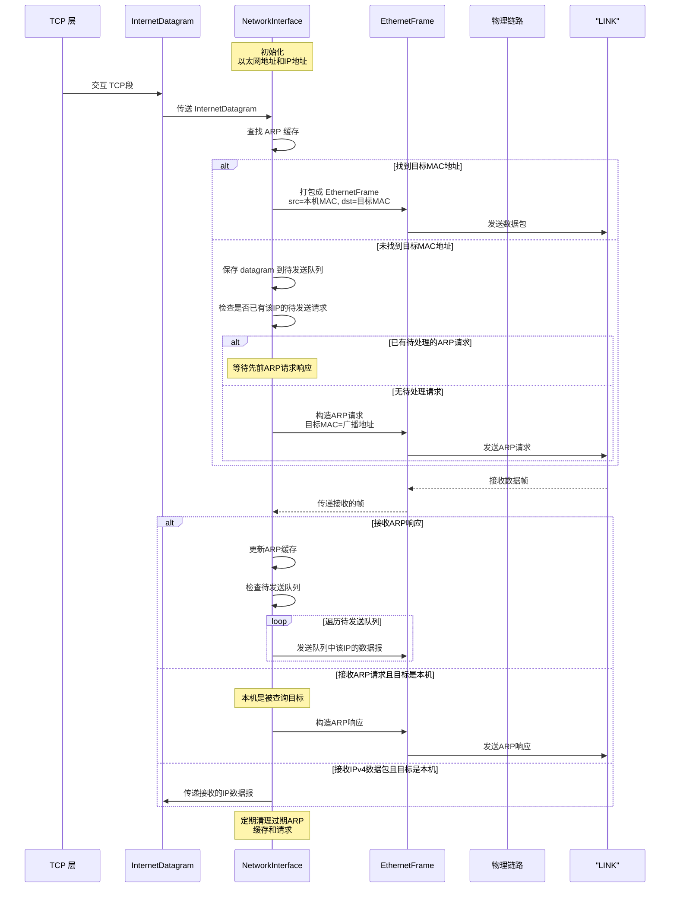
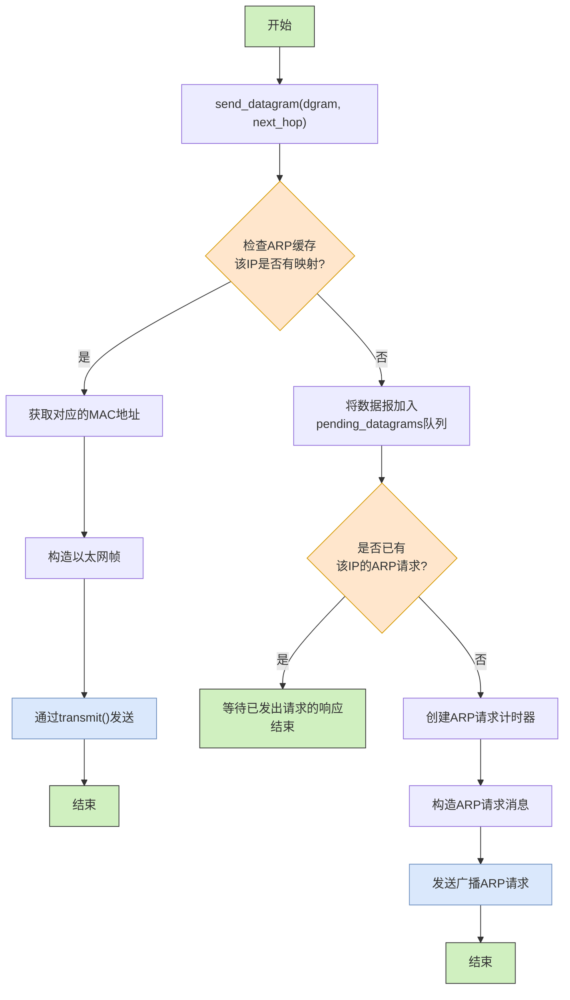
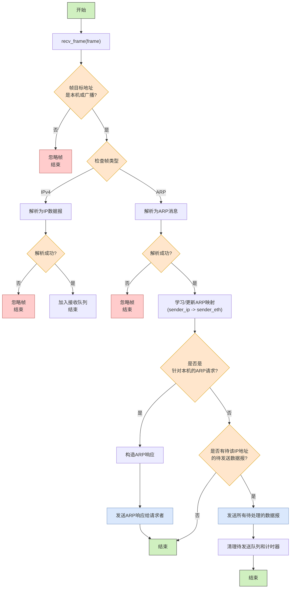

# CS144 Lab5 实战记录：网络接口 Network Interface 实现 ARP

## 1 实验背景与目标

在这一次的 CS144 实验中，我们需要实现的是协调 IP 分级和链路层之间的连接部分：**网络接口 Network Interface**，它能将 IP 数据报包装裱成 Ethernet 带有地址的链路层帧，并转发到 TAP 设备。

它是 TCP/IP 网络堆栈的最下层部分，也是后续 Lab6 实现路由器功能的重要基础。

## 2 模块流程

网络接口的运行流程基于 ARP 协议，通过 ARP 请求/响应 来查询 IP-网卡 MAC 地址是否可达，并记录在本地缓存中。



整个工作流程可分为以下几个关键部分：

1. 发送数据报流程：当上层协议需要发送数据时，先查询ARP缓存。
	- 若找到目标MAC地址，直接封装成以太网帧发送
	- 若未找到，保存数据报并发送ARP请求
2. 接收数据帧流程：接收以太网帧并检查目标MAC是否为本机或广播。处理ARP请求/响应，更新本地ARP缓存，处理IPv4数据包，解析后上传到网络层。
3. 定时维护流程：定期检查ARP缓存条目过期情况，清理超时未响应的ARP请求和待发送数据。

## 3 网络接口实现

### 3.1 数据结构

网络接口的实现核心在于ARP（地址解析协议）的管理，它将逻辑IP地址映射到物理MAC地址。我们使用以下数据结构来支持这一功能。

1. **ARP缓存管理**：使用`unordered_map`实现IP到MAC地址的高效查询（O(1)平均查找时间），每个条目包含MAC地址和存活时间计时器，遵循RFC建议的30秒TTL，缓存设计有助于减少网络请求，提高性能。
2. **待处理数据报管理**：`pending_datagrams_`存储等待ARP回复的IP数据报列表。使用IP地址作为键，支持一次ARP回复后批量处理多个等待的数据报。
3. **ARP请求限流机制**：`pending_datagram_timers_`跟踪ARP请求的发送时间，防止短时间内重复发送ARP请求，减轻网络广播风暴，符合RFC826推荐的5秒重传间隔

```cpp
// ARP entry validity period and retransmission interval (30s / 5s recommended by RFC826)
static constexpr size_t ARP_ENTRY_TTL_ms      = 30'000;  // 30 s
static constexpr size_t ARP_REQUEST_PERIOD_ms = 5'000;   // 5 s
using Timer = uint64_t;
using AddressNumber = uint32_t;

struct ArpEntry
{
    EthernetAddress ethernet_address;
    Timer timer;
};

// ARP cache: maps IP addresses to Ethernet addresses
std::unordered_map<AddressNumber, ArpEntry> arp_cache_ {};
// Pending datagrams: maps IP addresses to datagrams waiting for ARP replies
std::unordered_map<AddressNumber, std::vector<InternetDatagram>> pending_datagrams_ {};
// Pending datagram timers: maps IP addresses to timers for retransmitting ARP requests
std::unordered_map<AddressNumber, Timer> pending_datagram_timers_ {};
```

### 3.2 send_datagram：转发 IP 数据报

当上层协议需要发送IP数据报时，网络接口需要完成IP地址到MAC地址的转换，并将数据报封装到以太网帧中，实现流程如下图所示：



```cpp
void NetworkInterface::send_datagram( const InternetDatagram& dgram, const Address& next_hop )
{
  // Convert the Address to a numeric representation for easier lookup
  const AddressNumber next_hop_ip = next_hop.ipv4_numeric();

  // Check if the next hop's Ethernet address is already in the ARP cache
  auto arp_it = arp_cache_.find( next_hop_ip );
  if ( arp_it != arp_cache_.end() ) {
    // If found, get the Ethernet address and transmit the datagram immediately
    const EthernetAddress& next_hop_ethernet_address = arp_it->second.ethernet_address;
    transmit( { { next_hop_ethernet_address, ethernet_address_, EthernetHeader::TYPE_IPv4 }, serialize( dgram ) } );
    return;
  }

  // If not found, queue the datagram for later transmission
  pending_datagrams_[next_hop_ip].emplace_back( dgram );

  // Check if an ARP request for this IP is already pending
  if ( pending_datagram_timers_.find( next_hop_ip )!= pending_datagram_timers_.end() ) {
    // If yes, do nothing; an ARP request is already in flight
    return;
  }

  // If no ARP request is pending, send one
  // Start a timer to track the ARP request
  pending_datagram_timers_.emplace( next_hop_ip, Timer {} );

  // Construct the ARP request message
  const ARPMessage arp_request = {
    .opcode = ARPMessage::OPCODE_REQUEST,
    .sender_ethernet_address = ethernet_address_,
    .sender_ip_address = ip_address_.ipv4_numeric(),
    .target_ethernet_address = {}, // Target Ethernet address is unknown, hence left empty
    .target_ip_address = next_hop_ip
  };

  // Encapsulate the ARP request in an Ethernet frame and transmit it (broadcast)
  transmit({ { ETHERNET_BROADCAST, ethernet_address_, EthernetHeader::TYPE_ARP }, serialize(arp_request) });

}
```

### 3.3 recv_frame：接收 Ethernet 帧

当网络接口收到以太网帧时，需要根据帧类型进行不同处理：




```cpp
void NetworkInterface::recv_frame( EthernetFrame frame )
{
  // Ignore frames not destined for this interface's Ethernet address or the broadcast address
  if ( frame.header.dst != ethernet_address_ && frame.header.dst != ETHERNET_BROADCAST ) {
    return;
  }

  // Check the Ethernet frame type
  if ( frame.header.type == EthernetHeader::TYPE_IPv4 ) {
    // If it's an IPv4 datagram, try to parse it
    InternetDatagram dgram;
    if ( parse( dgram, frame.payload ) ) {
      // If parsing is successful, push the datagram onto the received queue
      datagrams_received_.push( move( dgram ) );
    }
    return; // Processing finished for IPv4 frames
  }

  if ( frame.header.type == EthernetHeader::TYPE_ARP ) {
    // If it's an ARP message, try to parse it
    ARPMessage msg;
    if ( !parse( msg, frame.payload ) ) {
      // If parsing fails, ignore the frame
      return;
    }

    // Learn the mapping from the sender's IP and Ethernet addresses
    const AddressNumber sender_ip = msg.sender_ip_address;
    const EthernetAddress sender_eth = msg.sender_ethernet_address;
    // Add or update the entry in the ARP cache, resetting its timer
    arp_cache_[sender_ip] = { sender_eth, 0 };

    // Check if this is an ARP request specifically for our IP address
    if ( msg.opcode == ARPMessage::OPCODE_REQUEST && msg.target_ip_address == ip_address_.ipv4_numeric() ) {
      // If yes, construct an ARP reply
      ARPMessage arp_reply = {
        .opcode = ARPMessage::OPCODE_REPLY,
        .sender_ethernet_address = ethernet_address_, // Our Ethernet address
        .sender_ip_address = ip_address_.ipv4_numeric(), // Our IP address
        .target_ethernet_address = sender_eth, // The original sender's Ethernet address
        .target_ip_address = sender_ip // The original sender's IP address
      };

      // Encapsulate the ARP reply in an Ethernet frame and transmit it back to the sender
      transmit({ { sender_eth, ethernet_address_, EthernetHeader::TYPE_ARP }, serialize(arp_reply) });
    }

    // Check if we have any pending datagrams waiting for this sender's Ethernet address
    auto it = pending_datagrams_.find(sender_ip);
    if ( it != pending_datagrams_.end() ) {
      // If yes, iterate through the pending datagrams
      for ( const auto& dgram : it->second ) {
        // Transmit each pending datagram using the now-known Ethernet address
        transmit({ { sender_eth, ethernet_address_, EthernetHeader::TYPE_IPv4 }, serialize(dgram) });
      }
      // Remove the entry from the pending datagrams map
      pending_datagrams_.erase(it);
      // Remove the corresponding timer for the ARP request
      pending_datagram_timers_.erase(sender_ip);
    }
  }
}
```

### 3.4 tick：时间驻留管理

网络接口需要定期处理超时事件，包括清理过期的ARP缓存条目和丢弃超时未响应的ARP请求。每过一段时间，需要扫描缓存，删除过期项：

- 删除缓存中 30s 未更新的 IP-MAC 映射
- 删除 5s 内未回复的 ARP 请求，并且不再发送

```cpp
void NetworkInterface::tick(const size_t ms) {
  for (auto it = arp_cache_.begin(); it != arp_cache_.end(); ) {
    it->second.timer += ms;
    if (it->second.timer >= ARP_ENTRY_TTL_ms)
      it = arp_cache_.erase(it);
    else
      ++it;
  }

  for (auto it = pending_datagram_timers_.begin(); it != pending_datagram_timers_.end(); ) {
    it->second += ms;
    if (it->second >= ARP_REQUEST_PERIOD_ms) {
      pending_datagrams_.erase(it->first);
      it = pending_datagram_timers_.erase(it);
    } else {
      ++it;
    }
  }
}
```

## 4 DEBUG记录

在测试过程中，没有通过检测项：**Pending datagrams dropped when pending request expires**。具体错误如下：


这个测试检查当ARP请求超时后，网络接口是否正确丢弃相关的待发送数据报。这是因为 `tick()` 中忘记在删除超时的ARP请求计时器时同时删除对应的待发送数据报。实现时确保两者同步清理。

## 5 仓库地址

项目代码已上传至GitHub：https://github.com/HeZephyr/minnow

