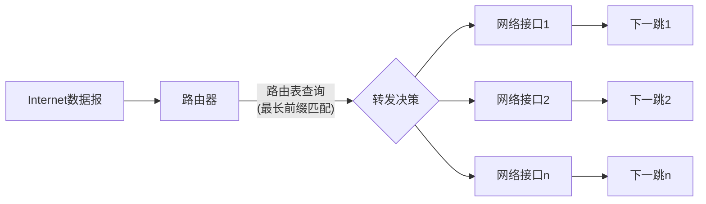
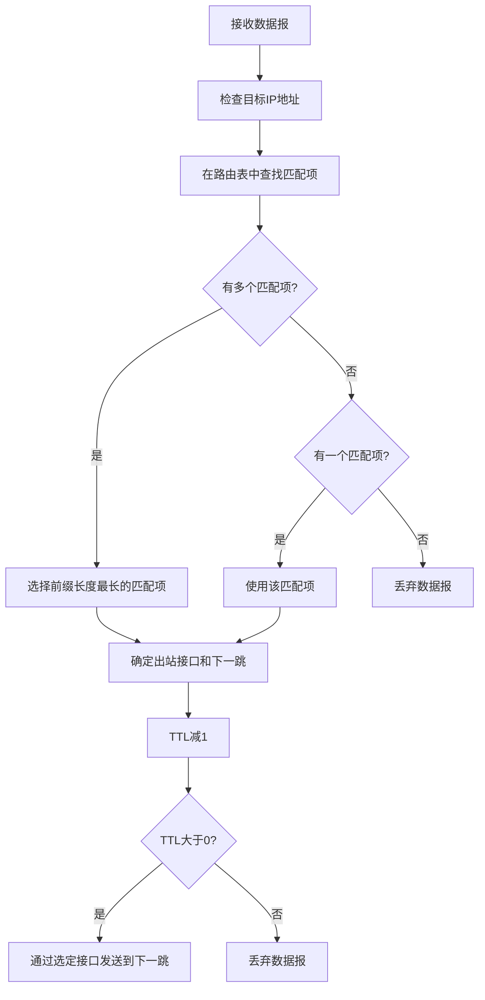
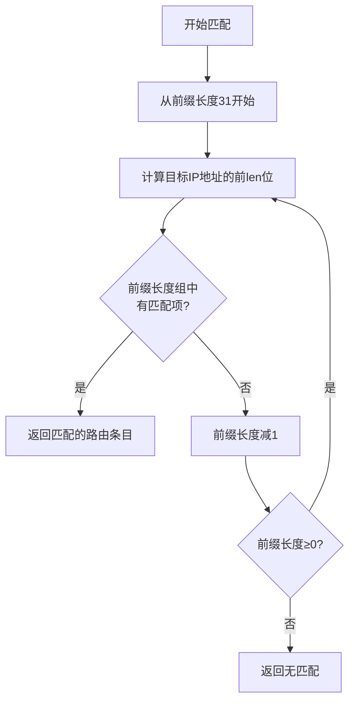
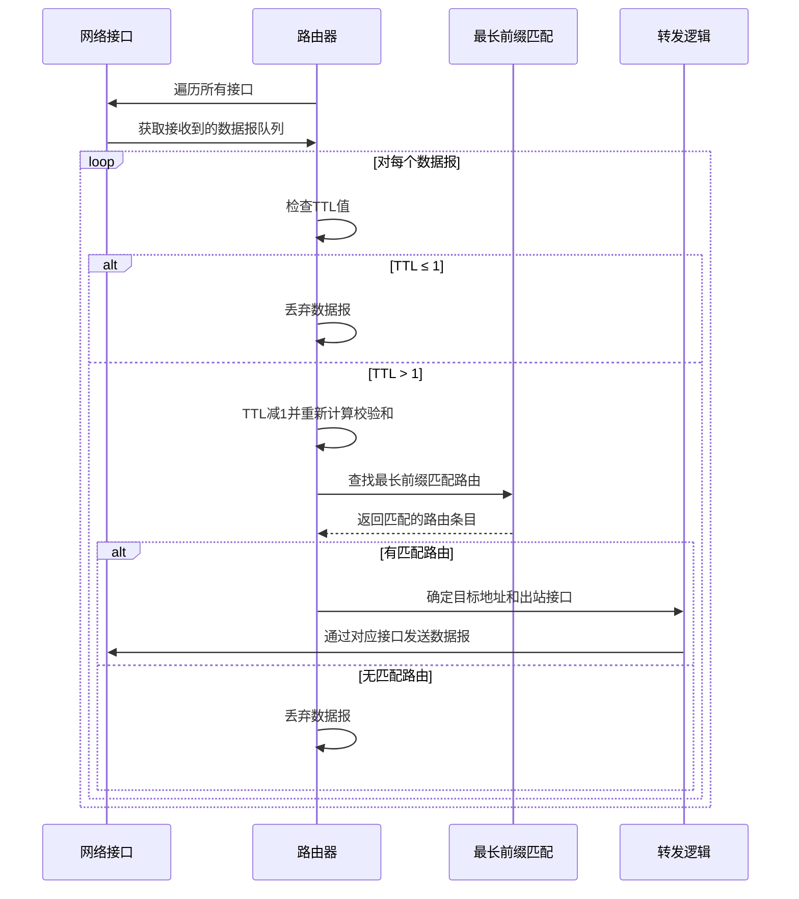

# CS144 Lab 6 实战记录：构建 IP 路由器

## 1 实验背景与目标

在 CS144 的 Lab 6 中，我们需要在之前实现的 NetworkInterface（Lab 5）基础上构建一个完整的 IP 路由器。路由器的主要任务是根据路由表将接收到的 IP 数据报转发到正确的网络接口，并发送给正确的下一跳（next hop）。

一个路由器拥有多个网络接口，可以在任何一个接口上接收 Internet 数据报。路由器的主要职责是根据路由表确定两件事：

- 应该使用哪个出站接口（interface）发送数据报
- 数据报的下一跳（next hop）IP 地址是什么

与前几个实验不同，IP 路由器的实现不需要了解 TCP、ARP 或以太网的细节，只需专注于 IP 层的转发逻辑。

## 2 路由器工作原理

### 2.1 路由器功能概述

IP 路由器主要完成两个关键功能：

1. **维护路由表**：存储一系列路由规则，每条规则包含网络前缀、前缀长度、下一跳信息和出站接口编号
2. **转发数据报**：根据路由表中的规则，将每个接收到的数据报转发到正确的出站接口和下一跳地址



### 2.2 最长前缀匹配原则

路由器使用最长前缀匹配（Longest Prefix Match）算法来选择最佳路由。这意味着当多个路由规则匹配一个目标 IP 地址时，路由器会选择前缀长度最长的那个规则。这样可以实现更精确的路由控制。例如，对于目标 IP 地址 `172.16.10.3`，可能匹配的规则有 `172.16.0.0/16` 和 `172.16.10.0/24`，路由器会选择前缀长度为 24 的规则，因为它提供了更精确的匹配。



## 3 路由器实现

### 3.1 数据结构设计

将路由表按前缀长度（1-32）分成32个组，方便从长到短进行最长前缀匹配。每个前缀长度组内使用哈希表存储，表示匹配前缀与路由项的映射关系。

```cpp
struct RouteEntry {
  size_t interface_num {};      // 出站接口编号
  std::optional<Address> next_hop {}; // 下一跳地址（如果有）
};

// 路由表，按前缀长度分组（最多32个组，对应IPv4地址的32位，逆序表示。例如下标为0代表前缀长度32）
std::array<std::unordered_map<uint32_t, RouteEntry>, 32> routing_table_ {};
```

### 3.2 添加路由条目

`add_route`方法向路由表添加一条新的路由规则，具体处理逻辑：

1. **前缀计算**：使用右移操作获取有效前缀位，例如：对于 `192.168.1.0/24`，右移 `(32-24) = 8` 位，保留高 24 位作为匹配前缀。<font color="red">需要特别处理前缀长度为 0 的默认路由，避免右移 32 位导致的未定义行为</font>
2. **路由条目存储**：将路由条目存入对应前缀长度的哈希表中，键是处理后的前缀，值是路由条目信息

```cpp
void Router::add_route(const uint32_t route_prefix,
                      const uint8_t prefix_length,
                      const optional<Address> next_hop,
                      const size_t interface_num) {
  cerr << "DEBUG: adding route " << Address::from_ipv4_numeric(route_prefix).ip() << "/"
       << static_cast<int>(prefix_length) << " => " << (next_hop.has_value() ? next_hop->ip() : "(direct)")
       << " on interface " << interface_num << "\n";

  // 截取route_prefix的前prefix_length位作为有效前缀
  uint32_t masked_prefix = (prefix_length == 0) ? 0 : (route_prefix >> (32 - prefix_length));

  // 插入到对应前缀长度的路由表中
  routing_table_[prefix_length][masked_prefix] = { interface_num, next_hop };
}
```

### 3.3 路由匹配查找

`match` 方法实现最长前缀匹配算法，为每个数据报找到最佳路由：




```cpp
optional<Router::RouteEntry> Router::match(uint32_t dst_addr) const noexcept {
  for (int len = 31; len >= 0; --len) {
    uint32_t masked = (len == 0) ? 0 : (dst_addr >> (32 - len));
    const auto& table = routing_table_[len];
    auto it = table.find(masked);
    if (it != table.end()) {
      return it->second;
    }
  }
  
  return nullopt;
}
```

### 3.4 数据报转发处理

`route` 方法是路由器的核心功能，负责处理所有接口收到的数据报并进行转发。




```cpp
void Router::route() {
  for (const auto& interface : interfaces_) {
    auto& datagrams_received = interface->datagrams_received();
    
    // 处理所有收到的数据报
    while (!datagrams_received.empty()) {
      InternetDatagram datagram = move(datagrams_received.front());
      datagrams_received.pop();
      
      // TTL ≤ 1表示不能再转发，直接丢弃
      if (datagram.header.ttl <= 1) {
        continue;
      }
      
      // TTL减1并重新计算校验和
      datagram.header.ttl -= 1;
      datagram.header.compute_checksum();
      
      // 使用最长前缀匹配查找路由条目
      auto routeEntry = match(datagram.header.dst);
      if (!routeEntry.has_value()) {
        continue;
      }
      
      // 如果没有指定下一跳，则直接发送到目标IP
      Address target = routeEntry->next_hop.value_or(Address::from_ipv4_numeric(datagram.header.dst));
      
      // 通过对应接口发送数据报
      interfaces_[routeEntry->interface_num]->send_datagram(datagram, target);
    }
  }
}
```

## 4 调试记录

1. 最初在计算掩码后的前缀时，使用了按位与操作，但这种方法对于可变长度前缀处理起来比较复杂。改用右移操作后，处理变得更简单高效。

2. 最初的实现中，先执行路由匹配再检查TTL，这导致一些应该被丢弃的数据报被错误处理。修正为先检查TTL再进行后续处理。

3. 处理前缀长度为0的默认路由时需要特殊处理，确保将掩码设置为0而不是尝试右移32位（这会导致未定义行为）。

	

## 5 代码仓库

项目代码已上传至GitHub：https://github.com/HeZephyr/minnow